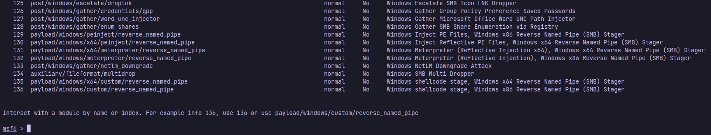
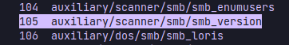
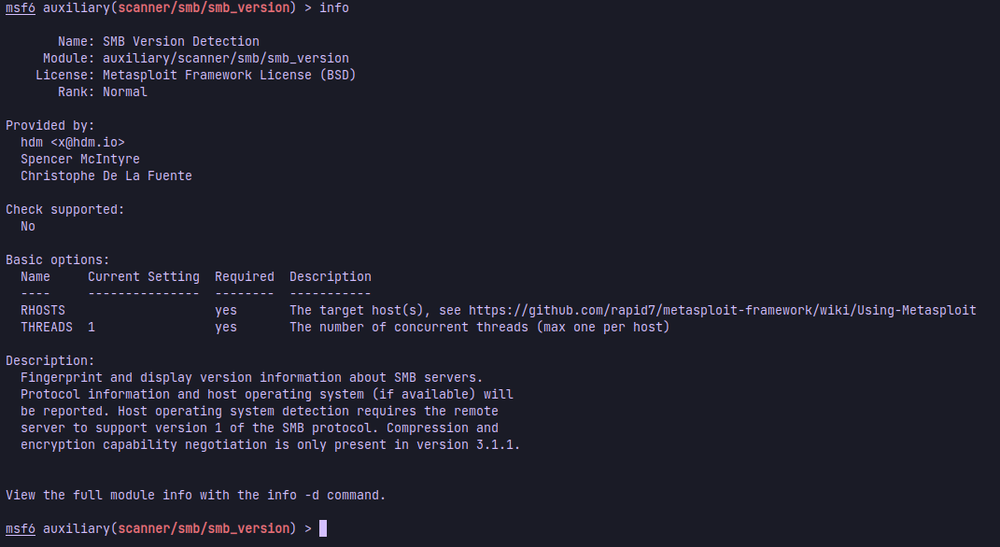
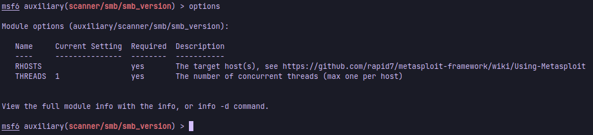
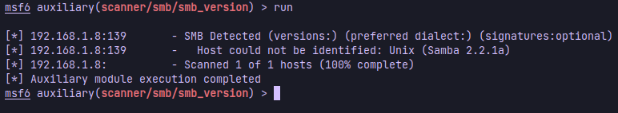
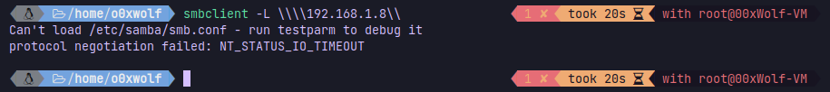
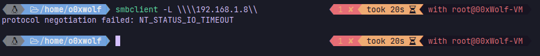
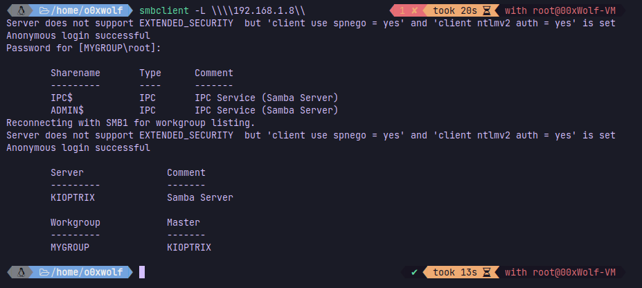
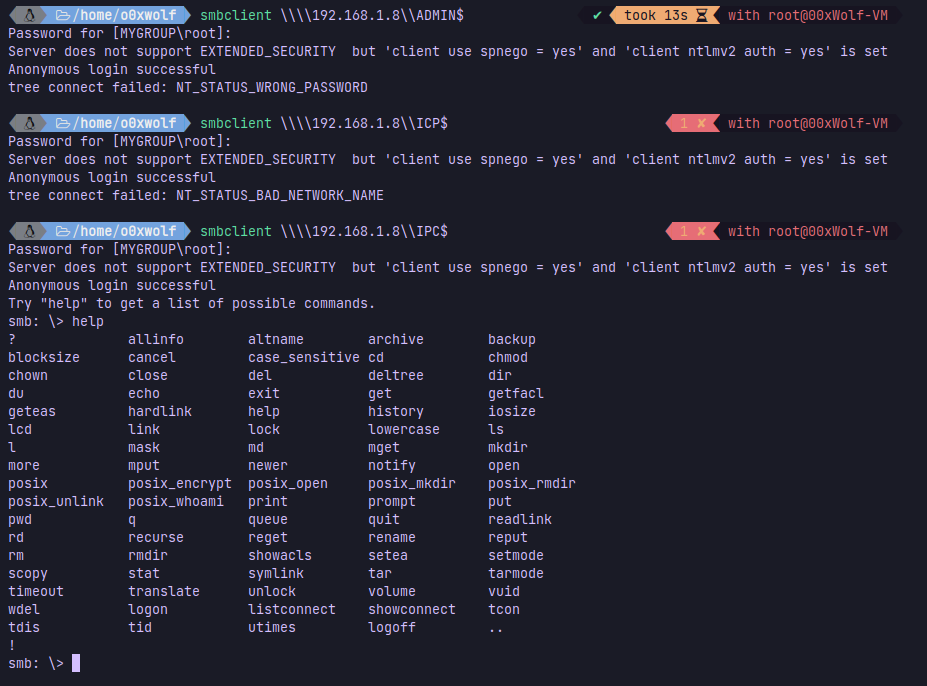

### Enumerating SMB

# [metasploit](https://www.metasploit.com/): a web server scanner
 >  **_metasploit :_**
 >  **a computer security project that provides information about security vulnerabilities and aids in penetration testing and IDS signature development. It is owned by Boston, Massachusetts-based security company Rapid7.**
 
- the usage: `msfconsole`
  - you can search with `search <keyword>`
  - eg `search smb`
    - 
    - 
	    
  - to run `use <module_name>` or `use <No. module>`
  - eg `use auxiliary/scanner/smb/smb_version` or `use 105`
    - run `info` to display module description
      - 
    - run `options` to list all available options
      - 

# Scanning

- run `set RHOSTS 192.168.1.8` to scan my host OS
  - then `run`
    - 

use `smbclient` to connect to the file share
- use `smbclient -<arg> \\\\<ip>\\`
  - eg `smbclient -L \\\\192.168.1.8\\`
     - get an error
	- 
	   - resolved via:
	     - `install samba`
	     - `sudo touch /etc/samba/smb.conf`
	     - copy [**`smb.conf.default`**](https://git.samba.org/samba.git/?p=samba.git;a=blob_plain;f=examples/smb.conf.default;hb=HEAD) to `/etc/samba/smb.conf`
	- run `smbclient -L \\\\192.168.1.8\\`  again
	  - get an error again
	    - 
	      - resolved [**`via`**](https://0xffsec.com/handbook/notes/smb-protocol-negotiation-failed/):
	        - edit `/etc/samba/smb.conf`
		- set `client min protocol` to `CORE`
		- set `client max protocol` to `SMB3`
	
	- run `smbclient -L \\\\192.168.1.8\\`  again
	  - write the root password(optional).
	  - 
	  - run `smbclient \\\\192.168.1.8\\ADMIN$` and `smbclient \\\\192.168.1.8\\IPC$` till getting the access
	    - 
