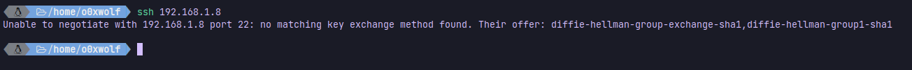
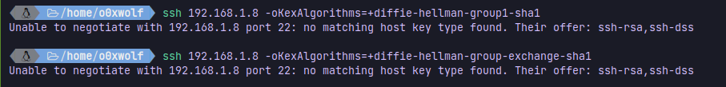

# Enumerating SSH

- run `ssh 192.168.1.8`
  - get an error
    - 
    - use `ssh 192.168.1.8 -oKexAlgorithms=+diffie-hellman-group1-sha1` or `ssh 192.168.1.8 -oKexAlgorithms=+diffie-hellman-group-exchange-sha1`
    - get an error again for both commands
    - 
