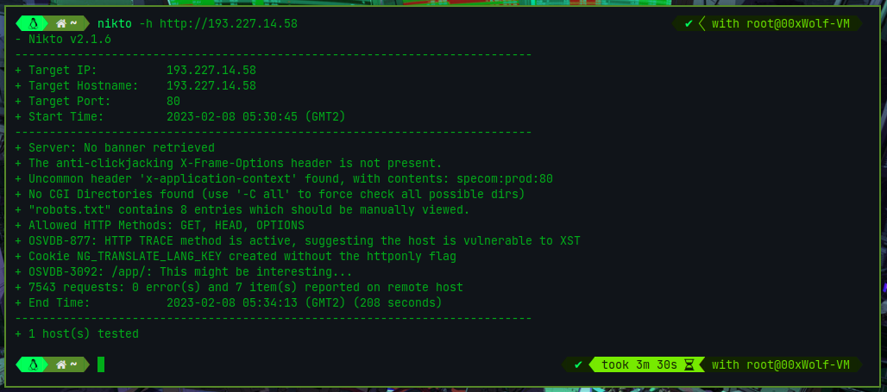

> **_NOTE:_**
> **You have  [Kioptrix]([https://tcm-sec.com/kioptrix](https://tcm-sec.com/kioptrix)) **

# Scanning & Enumeration

- [**`nikto`**](https://github.com/sullo/nikto)
 >  **_nikto :_**
 >  **a web server scanner**
 
- the usage: `nikto`  & `-<arg>` & `ip`
	- `nikto -h http://193.227.14.58`
	- [output:](#nikto-output)
	- 

- [**`dirbuster`**](https://sourceforge.net/projects/dirbuster/)
 >  **_dirbuster :_**
 >  **a multi threaded java application designed to brute force directories and files names on web/application servers.**
 
- the usage:
	-  
	- the output:
	- 


- [**`gobuster`**](https://github.com/OJ/gobuster)
> **_gobuster :_**
> ** a tool used to brute-force URIs(directories and files), DNS subdomains, Virtual Host names on target web servers, -   Open Amazon S3 buckets, Open Google Cloud buckets and TFTP servers.**

## nikto output

```bash
- Nikto v2.1.6

---------------------------------------------------------------------------

+ Target IP: 193.227.14.58

+ Target Hostname: 193.227.14.58

+ Target Port: 80

+ Start Time: 2023-02-08 02:52:43 (GMT2)

---------------------------------------------------------------------------

+ Server: No banner retrieved

+ The anti-clickjacking X-Frame-Options header is not present.

+ Uncommon header 'x-application-context' found, with contents: specom:prod:80

+ No CGI Directories found (use '-C all' to force check all possible dirs)

+ "robots.txt" contains 8 entries which should be manually viewed.

+ Allowed HTTP Methods: GET, HEAD, OPTIONS

+ OSVDB-877: HTTP TRACE method is active, suggesting the host is vulnerable to XST

+ Cookie NG_TRANSLATE_LANG_KEY created without the httponly flag

+ OSVDB-3092: /app/: This might be interesting...

+ 7543 requests: 0 error(s) and 7 item(s) reported on remote host

+ End Time: 2023-02-08 02:56:40 (GMT2) (237 seconds)

---------------------------------------------------------------------------

+ 1 host(s) tested
```
