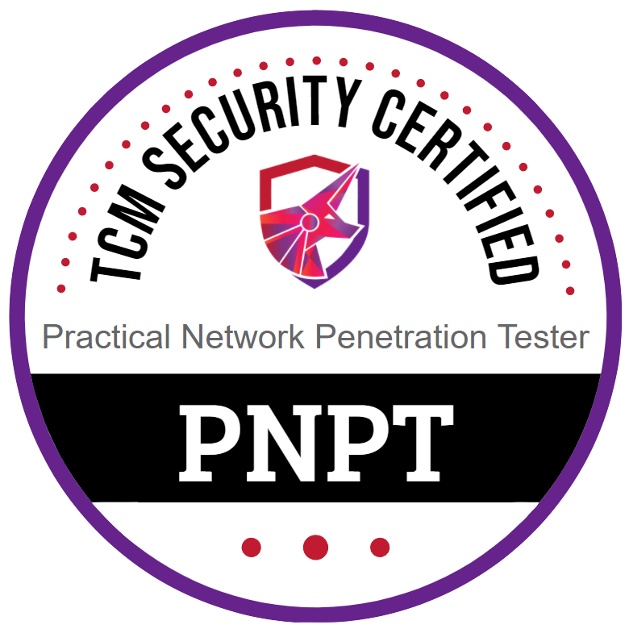

<h3 align="center"> <a href="https://certifications.tcm-sec.com/pnpt/">PNPT</a> </h3>

<!-- About -->
<h1 align="left"> :herb: About PNPT Training  </h1> 

 

 - the 1st course: [**`Practical Ethical Hacking`**](1_course/)
 - the 2nd course(optional): [**`Windows Privilege Escalation for Beginners`**](2_course/)
 - the 3rd course(optional): [**`Linux Privilege Escalation for Beginners`**](3_course/)
 - the 4th course: [**`Open Source Intelligence (OSINT) Fundamentals`**](4_course/)
 - the 5th course: [**`External Pentest Playbook`**](5_course/)

 

#

<!-- About -->
